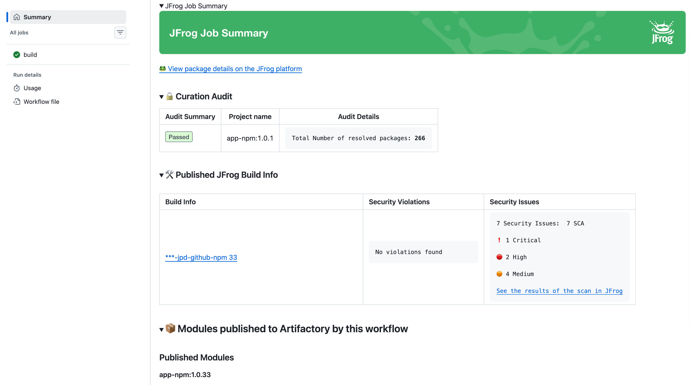
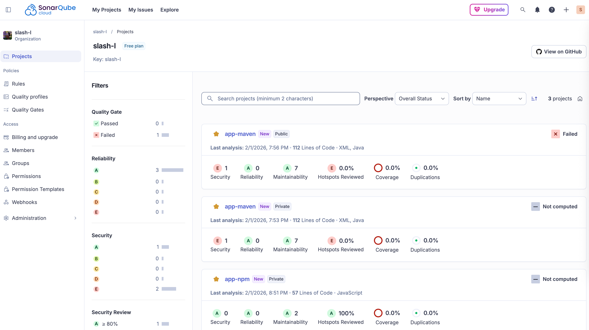
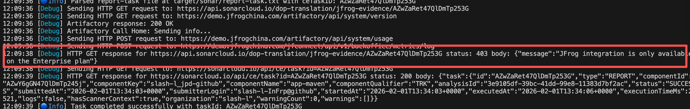

# 1. jpd-github 工程代码结构
JFrog integrates with Github
```
JPD-GITHUB/
├── .githunb/
│   └── workflows/
│       ├── demo-jfrogchina.yml
│       └── jfrog-github-oidc-example.yml
├── .jfrog/
├── app-maven
├── app-npm
└── README.md
```
分支 demo-jfrogchina 提交，自动触发 Github Action，展示 JFrog Summary.  



# 2. Evidence
## 2.1 Sonar
### 2.1.1 Sonar Scan
配置指南：  
https://sonarcloud.io/project/configuration/GitHubManual?id=slash-l_jpd-github

maven 工程
```
cd app-maven

export SONAR_TOKEN=<sonar token>

mvn verify org.sonarsource.scanner.maven:sonar-maven-plugin:sonar -Dsonar.projectKey=slash-l_jpd-github
```

npm 工程
```
cd app-npm

npm install -g @sonar/scan

sonar \
  -Dsonar.token=<sonar token> \
  -Dsonar.projectKey=slash-l_jpd-github \
  -Dsonar.organization=slash-l
```

SonarCloud 


### 2.1.2 Sonar Evidence
示例：
```
jf evd create \
--subject-repo-path slash-maven-dev-local/com/example/github/jfrog/maven/app-maven/0.0.1-SNAPSHOT/app-maven-0.0.1-20260201.131544-1.war \
--key ~/jpd-evidence-key/evidence.key \
--key-alias evd-key-20251230-150302 \
--integration sonar
```

报错，Sonar 集成 JFrog Evidence 需要企业版。  



## 2.2 Jenkins


# 3. Jenkins


