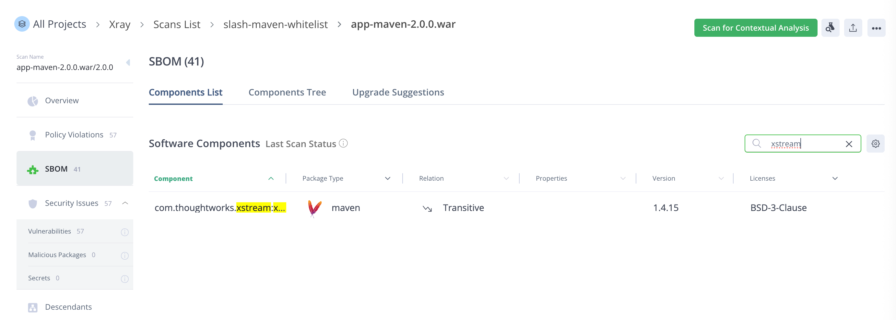
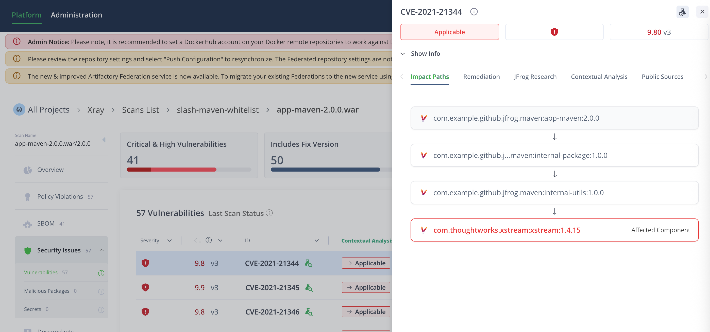

# Transitive Dependency Analysis
Demo 调用链：
```
app-maven:1.0.0 -> internal-package:1.0.0 ->internal-utils:1.0.0 -> xstream:1.4.15(CVE)
```
SBOM


Contextual Analysis


问题：  
Transitive 没有显示，仍然显示 Direct Applicable


